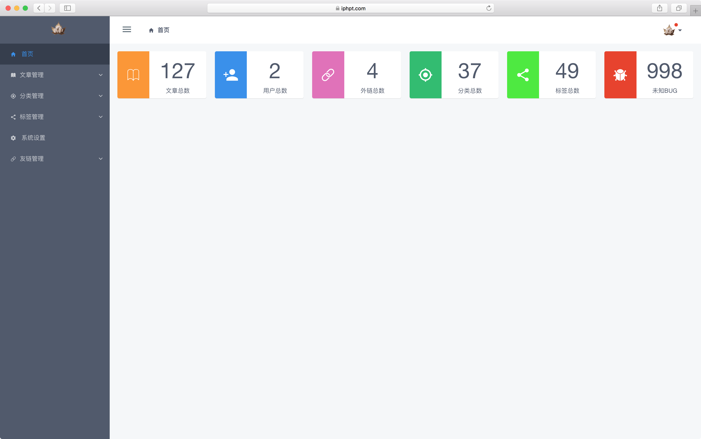
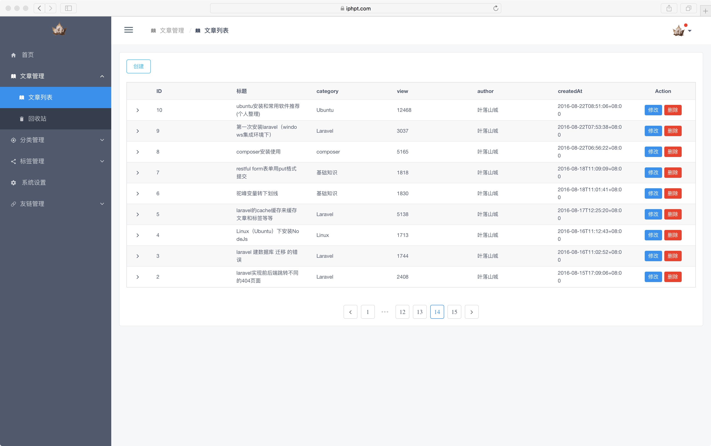

# go-blog-backend

go-blog 后台页面源码


修改后,执行 `npm run build` ,将`dist`里的文件复制到 `go-blog`的 `static/console`文件夹下


## Project setup
```
npm install
```

### Compiles and hot-reloads for development
```
npm run serve
```

### Compiles and minifies for production
```
npm run build
```

### Run your tests
```
npm run test
```

### Lints and fixes files
```
npm run lint
```

### Customize configuration
See [Configuration Reference](https://cli.vuejs.org/config/).

页面效果:

 登录: 
 首页: 
 列表: 